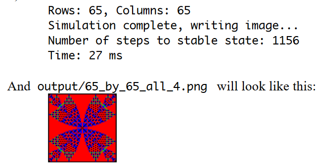

  

<h3 align="center">Sandpile Image Generator</h3>

---

This project compares the time taken to generate an Abelian sandpile using a parallel and serial solution. It demonstrates the advantages of parallelization and multithreading in computational simulations.   

- [About](#about)
- [Enhancements](#enhancements)
- [Prerequisites](#prerequisites)
- [Installing](#installing)
- [Running the Application](#tests)
- [Usage](#usage)
- [built_using](#built_using)
- [Authors](#authors)

## 🧐 About 
The Abelian Sandpile is a cellular automaton in which each cell contains a number of grains of sand. When the grains in a cell exceed a threshold (typically 4), the cell "topples," distributing grains to neighboring cells. This continues until the system reaches a stable state where no cell exceeds the threshold. The final stable configuration often reveals beautiful patterns of symmetry and complexity.

This project simulates sandpile evolution for various input configurations and generates colored output images based on the final stable state. It also benchmarks serial and parallel solutions to compare their performance under different input sizes and conditions.

The results are analyzed in the included Report.pdf, which explores the trade-offs of parallelization, its impact on performance, and the challenges encountered during the process.

The input folder contains different value parameters files we will be using to generate the sandpiles(on our output folder)

## 🔄 Enhancements 
This project was originally implemented as a sequential solution. I extended and optimized it by introducing parallelization and multithreading, resulting in significant performance improvements for larger inputs.

Key Changes:

- Parallel Computation: Introduced multithreading using the Fork/Join Framework, enabling efficient computation of sandpile stabilization across multiple threads.
- Scalable Performance: Reduced computation time significantly for larger grid sizes, leveraging parallel execution.
- Benchmarked Comparison: Conducted detailed benchmarks to compare serial vs. parallel performance for varying input sizes and configurations.
- Thread-safe Design: Ensured correctness through synchronization and safe thread interactions.

## Prerequisites 

GNU Make:
Linux: Pre-installed on most distributions othrwise install using your package manager if missing. 
Windows: Install make on git bash 

## 🔧 Running the application 

Shows you the results and time it takes to generate an image with a 65 by 65 all 4 input

## 🎈 Usage 

1. Go to the project folder
2. execute the command: make run
3. This will execute the code with the default input parameters input/65_by_65_all_4.csv output/65_by_65_all_4.png

OR 

If you would like to run with other parameters, then execute providing the other parameters, e.g: 
make run ARGS="input/517_by_517_centre_534578.csv output/517.png"

## ⛏️ Built Using 

- Java
- Multithreading (Thread and Runnable)
- ForkJoin Framework

## ✍️ Authors 

- Blessing Hlongwane 
<b>Note:<b> This project builds upon an earlier sequential implementation and introduces parallel processing to improve scalability and performance for computationally intensive tasks.
